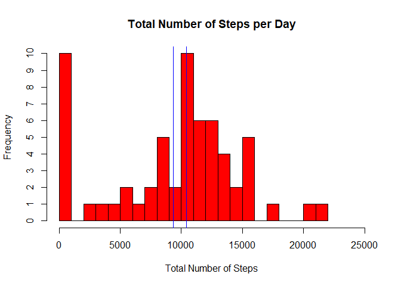
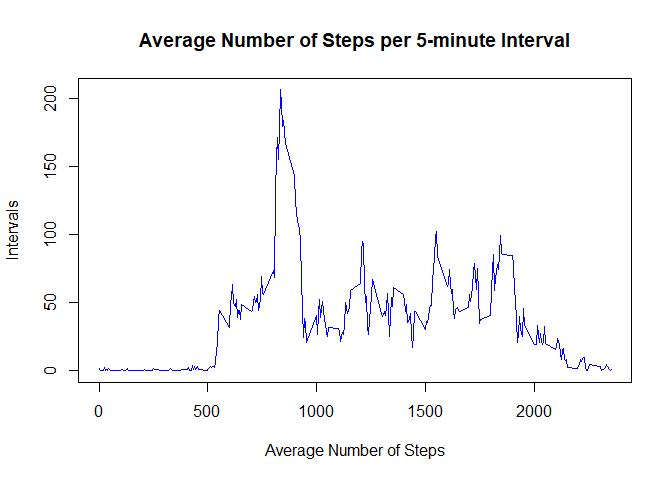
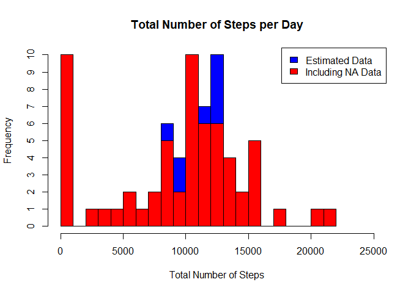
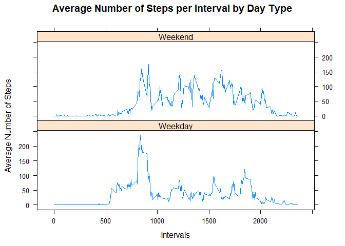

This project makes use of data from a personal activity monitoring device. This device collects data at 5 minute intervals throughout the day. The data consists of two months of data from an anonymous individual collected during the months of October and November in 2012 and include the number of steps taken in 5 minute intervals each day.

Prior to load the data, the required pacakges are listed below.

```r
library(dplyr)
library(ggplot2)
library(knitr)
```
## Loading and preprocessing the data
The data is loaded as a temporary dataset and stored as 'activity.'

```r
temp <- tempfile()
fileURL <- "https://d396qusza40orc.cloudfront.net/repdata%2Fdata%2Factivity.zip"
download.file(fileURL, temp)
unzip(temp)
activity <- read.csv("./activity.csv")
```
## What is mean total number of steps taken per day?
The histogram was generated using the following code. The mean and median of the total number of steps taken per day are shown in the blue lines on the histogram.

```r
# Calculate the total steps for each date
steps.by.day <- activity %>% 
                group_by(date) %>% 
                summarize(total = sum(steps, na.rm = TRUE))

# Make a histogram of the total number of steps taken each day
hist(steps.by.day$total,
     main = "Total Number of Steps per Day",
     xlab = "Total Number of Steps",
     ylim = c(0,10),
     yaxt = "n",
     xlim = c(0,25000),
     breaks = 24,
     col = "red")
axis(side = 2, at=seq(0, 10, by = 1), labels = seq(0, 10, by = 1))

# Calculate and report the mean and median of the total number of steps taken per day
mean.median <- steps.by.day %>% 
               summarize(mean = mean(total, na.rm = TRUE),
                         median = median(total, na.rm = TRUE)
                         )
# The calculation show 9354 (mean) and 10765 (median) steps per day

# Include the mean and median lines in the histogram
abline(v = mean.median$mean, lwd = 1, lty = 1, col = "blue") # This shows the median of 10765 per day
abline(v = mean.median$median, lwd = 1, lty = 1, col = "blue") # This shows the mean of 9354 steps per day
```

<!-- -->

## What is the average daily activity pattern?
The time series plot was generated using the following code.

```r
# Create a time series plot of the average number of steps taken
interval <- activity %>%
            group_by(interval) %>%
            summarize(average = mean(steps, na.rm = TRUE))

plot(x = interval$interval, 
     y = interval$average, 
     type = "l",
     main = "Average Number of Steps per 5-minute Interval",
     ylab = "Intervals",
     xlab = "Average Number of Steps",
     col = "blue")
```

<!-- -->

The time-series plot shows the aveage number of steps per 5-minute interval. The highest average number of steps (206) occurred at the interval of 835.

```r
# Which 5-minute interval, on average across all the days in the dataset, contains the maximum number of steps?
max.interval <- interval[(interval$average == max(interval$average)),] 
# This yields the result of 206 steps at the interval of 835.
```
## Imputing missing values
Use the code to determine the number of missing data

```r
sum(is.na(activity$steps)) # Answer is 2304
```

```
## [1] 2304
```
The strategy for filling in all of the missing values in the dataset involves determining the mean of steps per interval for each day of the week.

```r
# Use the weekdays() function to determine the day of the week for each date
activity$day <- weekdays(as.Date(activity$date))

# Get the list of missing activity data
missing <- activity[is.na(activity$steps),]

# Determine the mean of steps per interval for each day of the week.
interval.day <- activity %>%
                group_by(interval, day) %>%
                summarize(mean = mean(steps, na.rm = TRUE))
```
The new dataset is created by merging the missing values with the existing dataset. With the new dataset, the histogram is created using the following code.

```r
missing.values <- merge(missing, interval.day, by = c("day", "interval"))
missing.values$steps <- missing.values$mean
missing.values$mean <- NULL

exist <- activity[!is.na(activity$steps),]

new.data <- rbind(exist, missing.values)

new.steps.by.day <- new.data %>% 
                    group_by(date) %>% 
                    summarize(total = sum(steps, na.rm = FALSE))

hist(new.steps.by.day$total,
     main = "Total Number of Steps per Day",
     xlab = "Total Number of Steps",
     ylim = c(0,10),
     yaxt = "n",
     xlim = c(0,25000),
     col = "blue",
     breaks = 24)
hist(steps.by.day$total,
     main = "Total Number of Steps per Day",
     xlab = "Total Number of Steps",
     ylim = c(0,10),
     yaxt = "n",
     xlim = c(0,25000),
     col = "red",
     breaks = 24, add = TRUE)
axis(side = 2, at=seq(0, 10, by = 1), labels = seq(0, 10, by = 1))
legend("topright", c("Estimated Data", "Including NA Data"), fill = c("blue", "red"))
```

<!-- -->

With the new dataset, the mean and median were recalculated.

```r
mean.median.new <- new.steps.by.day %>% 
                   summarize(mean = mean(total, na.rm = TRUE),
                             median = median(total, na.rm = TRUE)
                             )
# New results: 10821 (mean) and 11015 (median)
```
Without imputing missing data, the mean and median total number of steps taken per day are 9354 and 10765, respectively. After imputing the missing data, the new mean and median total number of steps taken per day are 10821 and 11015, respectively. Cleary, the imputed data has an impact on the estimates of the total daily number of steps.

# Are there differences in activity patterns between weekdays and weekends?
The following code was used to categorize days as weekday or weekend. After calculating the average number of steps per interval by day type, the plot was created to compare the activity patterns between weekdays and weekends. 

```r
library(lattice)

new.data$week[(new.data$day == "Saturday") | (new.data$day == "Sunday")] <- "Weekend"
new.data$week[(new.data$day == "Monday") | (new.data$day == "Tuesday") | (new.data$day == "Wednesday") |
              (new.data$day == "Thursday") | (new.data$day == "Friday")] <- "Weekday"

week.type <- new.data %>% 
             group_by(interval, week) %>% 
             summarize(mean = mean(steps, na.rm = FALSE))

xyplot(mean ~ interval | week, data = week.type, 
       layout = c(1,2),
       type = "l",
       main = "Average Number of Steps per Interval by Day Type",
       xlab = "Intervals",
       ylab = "Average Number of Steps"
       )
```

<!-- -->

The activity patterns appear to be different between weekdays and weekends as indicated in the plot.
